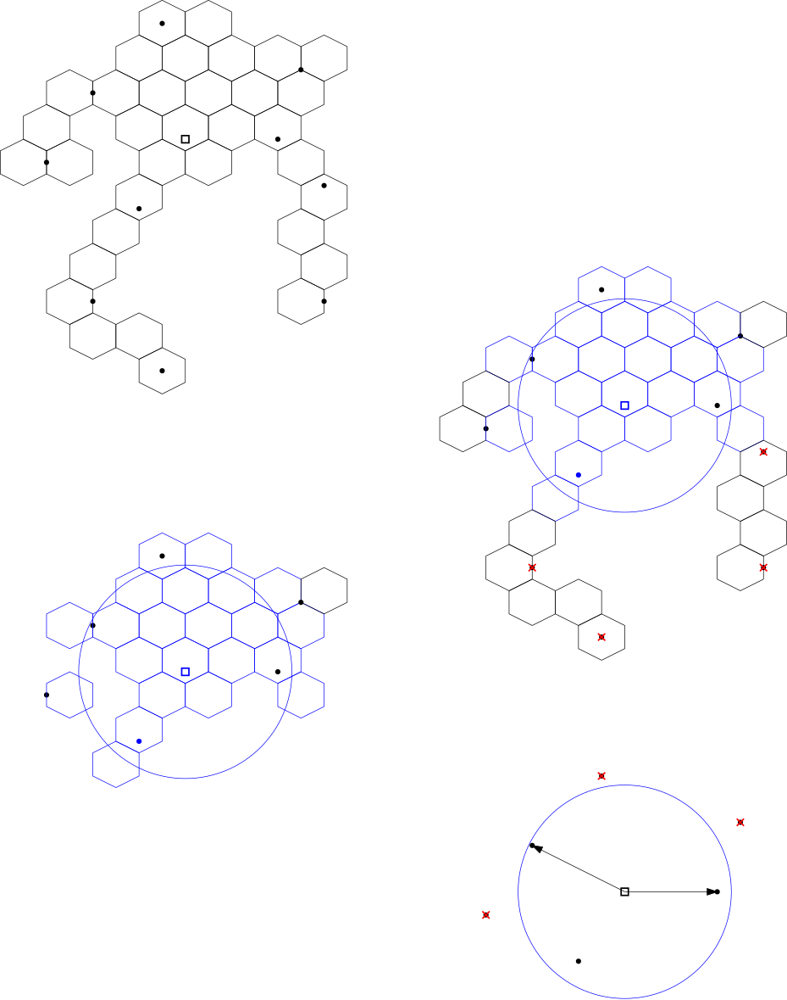

========================
Vehicle Location Service
========================

Overview questions
==================

Step 1
------

Given a database of existing vehicles, two functionalities are exposed here:

- Report location: a vehicle is able to update its coordinates given an ``id``. This is implemented by the ``vehicle_location_service.gis_functions.report_new_location`` function;
- List vehicles within a radius or an origin: The simplest approach is to query all existing vehicles, compute their distance to the origin and filter out the ones outside the provided radius. The distance is computed via a Great Circle distance implementation (in ``vehicle_location_service.distances.great_circle_distance_matrix``) and the filtering functionality is implemented by ``vehicle_location_service.gis_functions.filter_close_vehicles``.

Step 2
------

Despite being vectorized, the distance computation in the previous step can become costly with a large number of vehices in the database. An attempt to reduce the number of distance computations is to filter only vehicles contained in the same region as the incoming origin.

We make use of `H3 cells <https://h3geo.org/>`_ to descretize the planet. Each time a vehicle has its location updated a new H3 cell is computed and stored. Thus, given an incoming origin,

1. Find the corresponding H3 cell of this origin;
2. Use the H3 lookup functions to find all neighboring cells contained inside a radius from this origin cell;
3. Filter only the vehicles inside the cells computed in the previous step.

This is an approximation of the actual radius, but we can make a few adjustments to prevent leaving some vehicles out. The first is to adopt a good enough resolution value. In this work we adopted a resolution of 8, which indicates that each cell has roughly a diameter of 500 meters (on a second thought this value was way too conservative and slowed down some calculations. Maybe we can increase it to level 6, covering 2 km in a future work).

With that, when finding the neighboring cells, we query a larger size to compensate for the geometry differences between the H3 cells and a proper circle. Finally, we compute the distance of this (hopefully) smaller set of vehicles to the origin and proceed as before.

Step 3
------

The previous two functionalities were exposed in a REST API with the following endpoints.

Report vehicle
~~~~~~~~~~~~~~

To update an existing vehicle, make a PUT request:

.. code:: bash

   PUT <localhost:PORT>/vehicle

with the request body of the form

.. code:: json

    {
        "vehicle_id": 1,
        "lat": -23.45612,
        "lng": -46.12370
    }

This updates vehicle with id ``vehicle_id`` to the new coordinates, and automatically recomputes its H3 cell. The response has the form:

.. code:: json

    {
        "id": 1,
        "lat": -23.45612,
        "lng": -46.12370,
        "h3_cell": "fjskhfkdshjfdks"
    }

with the updated vehicle.

To create a new vehicle location, then use a POST request without the ``vehicle_id`` argument:

.. code:: json

    {
        "lat": -23.45612,
        "lng": -46.12370
    }

The output has the same format but with the id of the newly created vehicle.

List close vehicles
~~~~~~~~~~~~~~~~~~~

The second endpoint finds the closest vehicles from an origin and has the form

.. code:: bash

   GET <localhost:PORT>/closest-vehicles?origin_lat=-23.4561&origin_lng=-46.12318&radius=5&method={regular|h3-cells}

in which the query string parameters are:

- ``origin_lat`` and ``origin_lng``: coordinates of the origin;
- ``radius``: radius in km;
- ``method``: optional parameter indicating the filtering method. If ``h3-cells`` use the method specified in Step 2. For any other value uses the one in Step 1.

The response has the form:

.. code:: json

    {
        "closest_vehicles": [
            {
                "id": 1,
                "lat": -23.45612,
                "lng": -46.12370,
                "h3_cell": "fjskhfkdshjfdks"
            },
            ...
        ]
    }

Bonus
-----

The suggestion is to use two databases:

- A "static" one with detailed information about a vehicle that does not change very often, such as drivers info, vehicle's license plate etc. This can be any regular commercial relational database, such as PostgreSQL.
- A "dynamic" database with very frequent writes, since the vehicles' positions are changed every few seconds. This database should hold only the information that changes often, such as the coordinates and the h3 cell of a vehicle. I suggest a cache-based structure such as Redis. It can automatically drop vehicle records that were not updated for some time (meaning they are not currently working) and there is a Geospatial version which can make the distance computations in memory as well.

To handle optimization requests in each area, the load balancer can be used to route each request to a server closer to the request region. This should reduce latency in each API call.

The bottleneck is most likely in the H3 ring step, in which we find all H3 cells contained in the provided radius. If the radius is too large and/or the discretization level is too small both the neighborhood computation and the filtering of vehicles will be slow. To prevent such issues, the simplest approach is to limit the radius to an adequate value, maybe within a metropolitan zone. In addition, the H3 resolution can be better analysed. The value selected here (resolution 8, where each cell has approximately 500 m of diameter) may be too small and there may be no need to such resolution.

Finally, when including a mobile client, the most significant update would be to limit the number of returned vehicles -- maybe sort them by another parameter, such as rating --, or at least add a pagination mechanism.

Development
===========

This project requires `Python Poetry <https://python-poetry.org/>`_ to handle dependencies. Check the website for installation instructions.

Once its set, install the dependencies with

.. code:: bash

    poetry install

Before publishing a new feature or opening a pull request, ensure the following:

- The ``black`` formatter has been run:

.. code:: bash

   poetry run black --line-length 79 .

- The type hints are correct with ``mypy`` checker:

.. code:: bash

   poetry run mypy --ignore-missing-imports .

- Of course, the tests are passing:

.. code:: bash

   poetry run pytest -s -v tests/

Running locally
===============

First, create the database tables:

.. code:: bash

    poetry run python -m scripts.create_tables

The database starts empty, obviously. It can be populated with POST requests or a pre-made script.

Then, run the server with:

.. code:: bash

   poetry run python main.py

This starts a server at ``localhost`` at port 8000 by default. It you wish to change them, update the ``settings.toml`` or with an environment variable.
